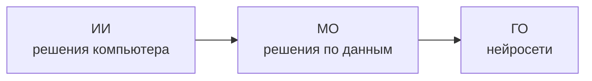
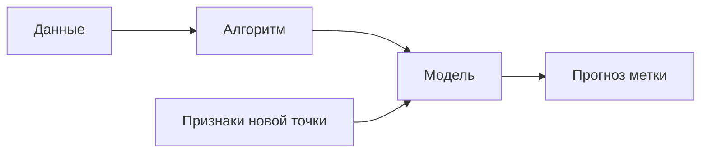

# Грокаем МО — конспект (с. 22–43)

Если экран пустой — открой [[0 НАЧНИ ЗДЕСЬ]].

Хранилище Obsidian по Серрано, *Грокаем машинное обучение* (Питер, 2024).

**Границы:** предисловие, вступление, «о книге» и литературные куски **не конспектирую**. Старт — глава 1 (с. 22). Стоп — **с. 43** (середина главы 2: [[Контролируемое обучение]] уже есть, [[Регрессия]] / [[Классификация]] — со с. 44, в этот срез не входят).

## Как пользоваться

1. Открой эту папку как vault: *Open folder as vault*.
2. Читай в порядке: [[01 По страницам]] → кликай `[[ссылки]]`.
3. Граф: `Open graph view` — узлы = понятия, рёбра = wiki-ссылки.
4. Зависимости одним взглядом: [[02 Что от чего зависит]].

## Карта

| Файл | Зачем |
|---|---|
| [[01 По страницам]] | определения по номерам страниц книги |
| [[02 Что от чего зависит]] | вложения, входы/выходы, что от чего |
| [[Глава 1]] · [[Глава 2]] | каркас глав без воды |
| `понятия/` | атомарные заметки — строительный материал графа |

## Иерархия (с. 25–28)

[[Искусственный интеллект]] ⊃ [[Машинное обучение]] ⊃ [[Глубокое обучение]]

## Конвейер прогноза (с. 28–36, 41–43)

## Три семьи МО (с. 40)

Названы; до с. 43 разобрана только первая.

- [[Контролируемое обучение]] ← нужны [[Размеченные данные]]
- [[Неконтролируемое обучение]] — определение **после** с. 43
- [[Обучение с подкреплением]] — определение **после** с. 43

## Понятия в этом срезе

- Иерархия: [[Искусственный интеллект]] · [[Машинное обучение]] · [[Глубокое обучение]] · [[Нейронная сеть]]
- Данные: [[Данные]] · [[Точка данных]] · [[Признак]] · [[Метка]] · [[Размеченные данные]] · [[Неразмеченные данные]]
- Процесс: [[Вспоминание-формулирование-прогнозирование]] · [[Алгоритм]] · [[Модель]] · [[Прогноз]]
- Типы: [[Контролируемое обучение]] · [[Неконтролируемое обучение]] · [[Обучение с подкреплением]]
