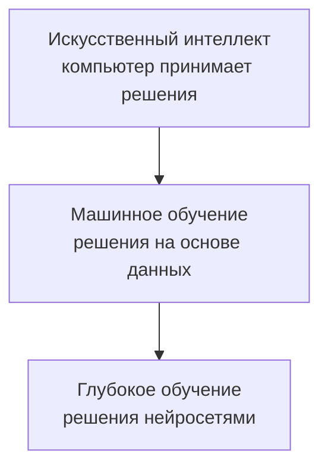
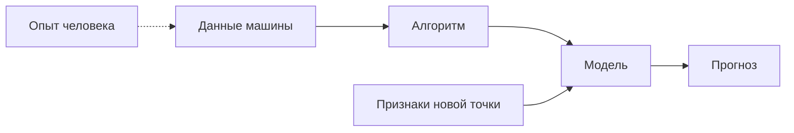
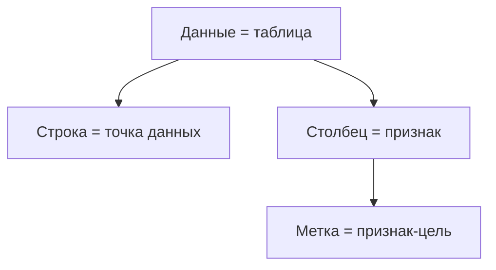
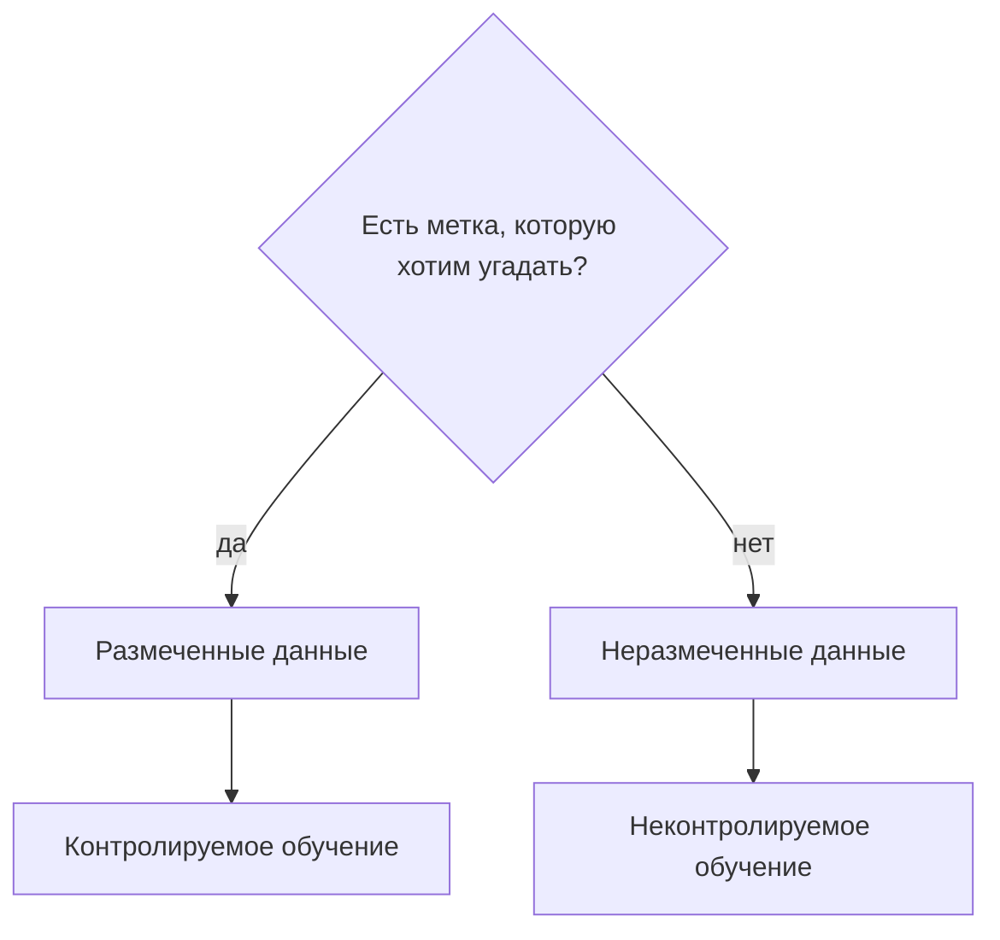

# Что от чего зависит

Только отношения, которые автор **уже зафиксировал** к с. 43. Стрелка `A → B` читается: **B зависит от A** (A — вход, условие или надмножество).

## 1. Вложение областей (с. 25–28)

| понятие | зависит от | является частью |
|---|---|---|
| [[Искусственный интеллект]] | факта, что решает **компьютер** | — |
| [[Машинное обучение]] | [[Данные]] как единственного основания решения | [[Искусственный интеллект]] |
| [[Глубокое обучение]] | [[Нейронная сеть\|нейронных сетей]] как метода | [[Машинное обучение]] |

ИИ **не** обязан быть МО: решение по явным инструкциям / поиску / правилам без обучения на данных — ИИ, но не МО.

## 2. Конвейер «данные → правило → ответ» (с. 28–36)

| что | от чего зависит | на что влияет |
|---|---|---|
| [[Данные]] | сбора опыта/таблицы | вход [[Алгоритм\|алгоритма]] |
| [[Алгоритм]] | шагов построения | порождает [[Модель]] |
| [[Модель]] | данных + алгоритма + выбранных [[Признак\|признаков]] | даёт [[Прогноз]] |
| [[Признак]] | того, какие свойства мы **решили** подать в модель | качество и вид правила |
| [[Прогноз]] | модели и признаков **новой** точки | решение (спам / дождь / …) |

Жёсткое разделение с. 30: **алгоритм строит, модель предсказывает**. Их нельзя менять местами.

## 3. Схема мышления (с. 28–29, 35, 43)

[[Вспоминание-формулирование-прогнозирование]] — каркас и человека, и машины, и [[Контролируемое обучение|контролируемого обучения]].

| шаг | человек | машина (с. 35) | контролируемое (с. 43) |
|---|---|---|---|
| вспомнить | похожие случаи | таблица прошлых [[Данные\|данных]] | датасет с [[Метка\|метками]] |
| сформулировать | общее правило | перебор правил/формул, выбор «сидящей» | правило класса (собака/кошка) |
| спрогнозировать | будущее | [[Модель]] на новых данных | метка новой точки |

На шаге «сформулировать» качество ещё **не** равно «лучше село на таблицу». Настоящий критерий (с. 36): **обобщение на новые данные**. От чего зависит «лучшая модель»: не только от обучающей таблицы, но и от поведения вне её.

## 4. Анатомия таблицы (с. 40–42)

| понятие | что это | от чего зависит |
|---|---|---|
| [[Данные]] | информация, обычно таблица | — |
| [[Точка данных]] | одна строка / один объект | таблицы |
| [[Признак]] | столбец / свойство объекта | представления данных |
| [[Метка]] | признак, который **прогнозируем** | **постановки задачи**, не файла |

Следствие: один датасет может быть [[Размеченные данные|размеченным]] для задачи A и [[Неразмеченные данные|неразмеченным]] для задачи B.

## 5. Метки решают тип обучения (с. 40–43)

| тип | вход | цель к с. 43 |
|---|---|---|
| [[Контролируемое обучение]] | [[Размеченные данные]] | [[Прогноз]] [[Метка\|метки]] новой точки |
| [[Неконтролируемое обучение]] | [[Неразмеченные данные]] | названо; **определение после с. 43** |
| [[Обучение с подкреплением]] | не таблица меток в этом смысле | названо; **определение после с. 43** |

Книга сознательно сужает фокус: дальше идёт контролируемое.

На с. 43 уже видно, что метка бывает **разной природы** (тип животного vs вес) — это развилка регрессия/классификация, но термины автор даёт **со с. 44**.

## 6. Что ломает прогноз

Цепочка отказов, уже показанная в главе 1:

1. Мало / кривые [[Данные]] → кривая [[Модель]].
2. Не те [[Признак|признаки]] (только отправитель vs день+размер) → правило бьёт мимо реальной причины.
3. Правило заточено под старую таблицу и **не обобщается** (с. 36) → на новых точках ошибка, даже если на старых всё «сошлось».

## Граф ссылок

В Obsidian: `Open graph view`. Цвета групп: иерархия / данные / процесс / тип МО — в настройках графа этого vault.
